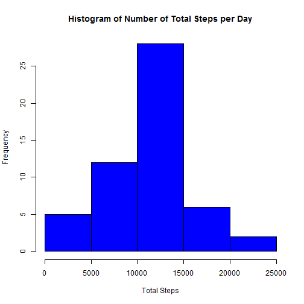
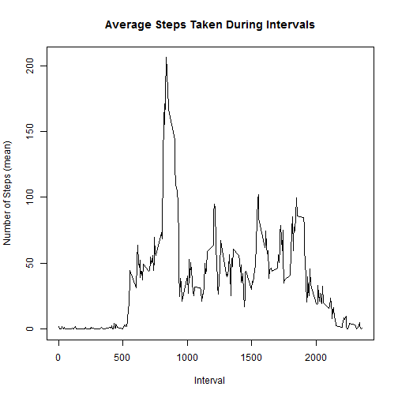
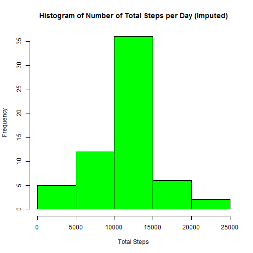
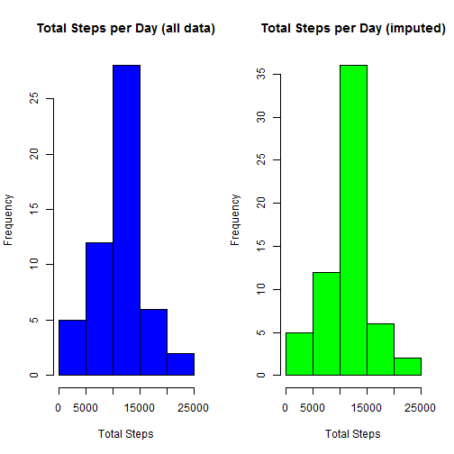
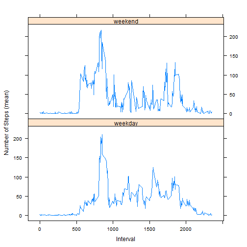

# PA1_template
## Description
This is an Oct 2015 submission for the Coursera repdata-033 "Reproducible Research" Peer Assessment Project 1.

Author: *Ryan Maley*

## Loading and preprocessing the data
The data was downloaded from the course web site at https://d396qusza40orc.cloudfront.net/repdata%2Fdata%2Factivity.zip

The data is read with the following, The date column was converted to an actual date class.

```r
        ZipArchive <- tempfile()
        ZipLocation <- "https://d396qusza40orc.cloudfront.net/repdata%2Fdata%2Factivity.zip"
        ZipArchive <- "repdata_data_activity.zip"

        ## Use this next line if you wish to download file from original location
        ## download.file(ZipLocation, ZipArchive)
        
        ## Read the data
        Activity <- (read.csv(unz(ZipArchive,"activity.csv")))

        ## Apply a proper date format
        Activity$date  <- as.Date(Activity$date,"%Y-%m-%d")
        library(dplyr)
```


## What is mean total number of steps taken per day?

*Please note: For the following, missing values are ignored i.e. excluded.*

Calculate the total number of steps taken per day

```r
        library(dplyr)
        Summarized <- Activity[complete.cases(Activity),] %>% 
                group_by(date) %>% 
                summarize("Total Steps"=sum(steps))
        Summarized
```

```
## Source: local data frame [53 x 2]
## 
##          date Total Steps
##        (date)       (int)
## 1  2012-10-02         126
## 2  2012-10-03       11352
## 3  2012-10-04       12116
## 4  2012-10-05       13294
## 5  2012-10-06       15420
## 6  2012-10-07       11015
## 7  2012-10-09       12811
## 8  2012-10-10        9900
## 9  2012-10-11       10304
## 10 2012-10-12       17382
## ..        ...         ...
```

Make a histogram of the total number of steps taken each day        

```r
        hist(Summarized$'Total Steps',col="blue",
             main="Histogram of Number of Total Steps per Day",
             xlab="Total Steps"
             )
```

 


Calculate and report the mean and median of the total number of steps taken per day

```r
        ## Calculate but save for use later
        MeanMedian_Raw <- 
                Activity[complete.cases(Activity),] %>% 
                        group_by(date) %>% 
                        summarize("Mean of Steps"=mean(steps),"Median of Steps"=median(steps))
        as.data.frame(MeanMedian_Raw)
```

```
##          date Mean of Steps Median of Steps
## 1  2012-10-02     0.4375000               0
## 2  2012-10-03    39.4166667               0
## 3  2012-10-04    42.0694444               0
## 4  2012-10-05    46.1597222               0
## 5  2012-10-06    53.5416667               0
## 6  2012-10-07    38.2465278               0
## 7  2012-10-09    44.4826389               0
## 8  2012-10-10    34.3750000               0
## 9  2012-10-11    35.7777778               0
## 10 2012-10-12    60.3541667               0
## 11 2012-10-13    43.1458333               0
## 12 2012-10-14    52.4236111               0
## 13 2012-10-15    35.2048611               0
## 14 2012-10-16    52.3750000               0
## 15 2012-10-17    46.7083333               0
## 16 2012-10-18    34.9166667               0
## 17 2012-10-19    41.0729167               0
## 18 2012-10-20    36.0937500               0
## 19 2012-10-21    30.6284722               0
## 20 2012-10-22    46.7361111               0
## 21 2012-10-23    30.9652778               0
## 22 2012-10-24    29.0104167               0
## 23 2012-10-25     8.6527778               0
## 24 2012-10-26    23.5347222               0
## 25 2012-10-27    35.1354167               0
## 26 2012-10-28    39.7847222               0
## 27 2012-10-29    17.4236111               0
## 28 2012-10-30    34.0937500               0
## 29 2012-10-31    53.5208333               0
## 30 2012-11-02    36.8055556               0
## 31 2012-11-03    36.7048611               0
## 32 2012-11-05    36.2465278               0
## 33 2012-11-06    28.9375000               0
## 34 2012-11-07    44.7326389               0
## 35 2012-11-08    11.1770833               0
## 36 2012-11-11    43.7777778               0
## 37 2012-11-12    37.3784722               0
## 38 2012-11-13    25.4722222               0
## 39 2012-11-15     0.1423611               0
## 40 2012-11-16    18.8923611               0
## 41 2012-11-17    49.7881944               0
## 42 2012-11-18    52.4652778               0
## 43 2012-11-19    30.6979167               0
## 44 2012-11-20    15.5277778               0
## 45 2012-11-21    44.3993056               0
## 46 2012-11-22    70.9270833               0
## 47 2012-11-23    73.5902778               0
## 48 2012-11-24    50.2708333               0
## 49 2012-11-25    41.0902778               0
## 50 2012-11-26    38.7569444               0
## 51 2012-11-27    47.3819444               0
## 52 2012-11-28    35.3576389               0
## 53 2012-11-29    24.4687500               0
```

## What is the average daily activity pattern?

Make a time series plot (i.e. type = "l") of the 5-minute interval (x-axis) and the average number of steps taken, averaged across all days (y-axis)

```r
        Summarized <- Activity[complete.cases(Activity),] %>% 
                group_by(interval) %>% 
                summarize("Mean of Steps"=mean(steps))

        plot(x=Summarized$interval, y=Summarized$`Mean of Steps`,type="l",
                xlab="Interval",
                ylab="Number of Steps (mean)",
                main="Average Steps Taken During Intervals"
        )
```

 

Which 5-minute interval, on average across all the days in the dataset, contains the maximum number of steps?

```r
        x <- Summarized[Summarized$`Mean of Steps`==max(Summarized$`Mean of Steps`),1]
        cat("Interval with highest mean =",as.character(x))
```

```
## Interval with highest mean = 835
```

## Imputing missing values
Note that there are a number of days/intervals where there are missing values (coded as NA). The presence of missing days may introduce bias into some calculations or summaries of the data.

Calculate and report the total number of missing values in the dataset (i.e. the total number of rows with NAs)

```r
        x <- sum(!complete.cases(Activity))
        cat("Number of rows with missing values =",as.character(x))
```

```
## Number of rows with missing values = 2304
```


Devise a strategy for filling in all of the missing values in the dataset. The strategy does not need to be sophisticated. For example, you could use the mean/median for that day, or the mean for that 5-minute interval, etc.

Create a new dataset that is equal to the original dataset but with the missing data filled in.

```r
        ## This uses the *mean* for a given interval to replace missing steps values (NAs)
        ## 'Summarized' contains means of steps for each interval (see above)
        Summarized <- as.data.frame(Summarized)

        ## Create something to hold activity and imputed activity
        Imputed <- Activity

        ## Find rows with missing (NA) data and replace with mean for the interval
        for (i in 1:nrow(Imputed)) {
                if (is.na(Imputed$steps[i])) {
                        ## Lookup the mean (in Summarized) for the interval of this row
                        n <- Summarized[Summarized$interval==Imputed$interval[i],"Mean of Steps"]
                        Imputed$steps[i]<- as.integer(round(n))
                }
        }
```

        
Make a histogram of the total number of steps taken each day

```r
        Summarized <- Imputed %>% 
                group_by(date) %>% 
                summarize("Total Steps"=sum(steps))
        
        hist(Summarized$'Total Steps',col="green",
             main="Histogram of Number of Total Steps per Day (Imputed)",
             xlab="Total Steps"
        )
```

 


Calculate and report the mean and median total number of steps taken per day. 

```r
        MeanMedian_Imputed <- 
                Imputed %>% 
                group_by(date) %>% 
                summarize("Mean of Steps"=mean(steps),"Median of Steps"=median(steps))
        MeanMedian_Imputed
```

```
## Source: local data frame [61 x 3]
## 
##          date Mean of Steps Median of Steps
##        (date)         (dbl)           (dbl)
## 1  2012-10-01      37.36806            34.5
## 2  2012-10-02       0.43750             0.0
## 3  2012-10-03      39.41667             0.0
## 4  2012-10-04      42.06944             0.0
## 5  2012-10-05      46.15972             0.0
## 6  2012-10-06      53.54167             0.0
## 7  2012-10-07      38.24653             0.0
## 8  2012-10-08      37.36806            34.5
## 9  2012-10-09      44.48264             0.0
## 10 2012-10-10      34.37500             0.0
## ..        ...           ...             ...
```


Do these values differ from the estimates from the first part of the assignment? 

```r
        summary(MeanMedian_Raw,2:3)
```

```
##       date            Mean of Steps     Median of Steps
##  Min.   :2012-10-02   Min.   : 0.1424   Min.   :0      
##  1st Qu.:2012-10-16   1st Qu.:30.6979   1st Qu.:0      
##  Median :2012-10-29   Median :37.3785   Median :0      
##  Mean   :2012-10-30   Mean   :37.3826   Mean   :0      
##  3rd Qu.:2012-11-16   3rd Qu.:46.1597   3rd Qu.:0      
##  Max.   :2012-11-29   Max.   :73.5903   Max.   :0
```

```r
        summary(MeanMedian_Imputed,2:3)
```

```
##       date            Mean of Steps     Median of Steps 
##  Min.   :2012-10-01   Min.   : 0.1424   Min.   : 0.000  
##  1st Qu.:2012-10-16   1st Qu.:34.0938   1st Qu.: 0.000  
##  Median :2012-10-31   Median :37.3681   Median : 0.000  
##  Mean   :2012-10-31   Mean   :37.3807   Mean   : 4.525  
##  3rd Qu.:2012-11-15   3rd Qu.:44.4826   3rd Qu.: 0.000  
##  Max.   :2012-11-30   Max.   :73.5903   Max.   :34.500
```

What is the impact of imputing missing data on the estimates of the total daily number of steps?

```r
        ## Create side-by-side plots for visual comparison
        plot.new()
        par(mfrow=c(1,2) )
        
        Summarized <- Activity[complete.cases(Activity),] %>% 
                group_by(date) %>% 
                summarize("Total Steps"=sum(steps))
        hist(Summarized$'Total Steps',col="blue",
             main="Total Steps per Day (all data)",
             xlab="Total Steps"
             )

        Summarized <- Imputed %>% 
                group_by(date) %>% 
                summarize("Total Steps"=sum(steps))
        hist(Summarized$'Total Steps',col="green",
             main="Total Steps per Day (imputed)",
             xlab="Total Steps"
             )
```

 
s

## Are there differences in activity patterns between weekdays and weekends?

For this part the weekdays() function may be of some help here. 
Use the dataset with the filled-in missing values for this part.
Create a new factor variable in the dataset with two levels - "weekday" and "weekend" indicating whether a given date is a weekday or weekend day.

```r
        # Create the names, doesnt seem to be an R constant available
        DayOfWeek <- data.frame(
                name=c("Monday","Tuesday","Wednesday","Thursday","Friday","Saturday","Sunday"),
                part=c("weekday","weekday","weekday","weekday","weekday","weekend","weekend"))

        ## Create the column
        Imputed$WeekPart <- as.factor(weekdays(Imputed$date))
        ## Set the value
        Imputed$WeekPart <- DayOfWeek[Imputed$WeekPart,2]
```

Make a panel plot containing a time series plot (i.e. type = "l") of the 5-minute interval (x-axis) and the average number of steps taken, averaged across all weekday days or weekend days (y-axis). 
See the README file in the GitHub repository to see an example of what this plot should look like using simulated data.

```r
        ## Calculate and store the means by group
        PlotSummary <- Imputed %>% 
                group_by(WeekPart,interval) %>% 
                summarize(StepsMean=mean(steps))

        ## Use the lattice graphics for easier multiple panels
        library(lattice)
        xyplot(PlotSummary$StepsMean ~ PlotSummary$interval | PlotSummary$WeekPart, 
               data=PlotSummary, type="l", layout=c(1:2),
               ylab="Number of Steps (mean)",
               xlab="Interval")
```

 

### End of Submission
